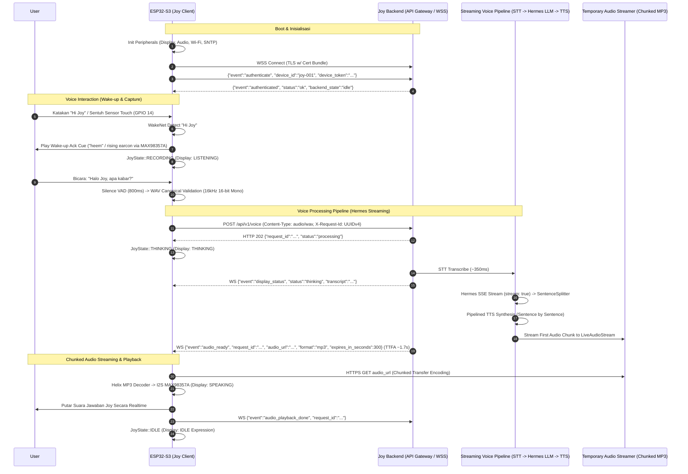

# Joy-1-2 — ESP32-S3 Voice Assistant Hardware Client

Repository ini berisi source code firmware ESP-IDF dan dokumentasi integrasi hardware client **Joy** berbasis **ESP32-S3** yang terhubung secara realtime ke **Joy Backend Ecosystem** melalui WebSocket dan HTTPS.

---

## 1. Arsitektur Sistem & Data Flow

Joy Hardware Client berkomunikasi secara bidirectional dengan Joy Backend:



> **Catatan Optimasi Pipeline**: Backend menggunakan **Hermes Streaming** (`POST /v1/chat/completions` SSE stream dengan `stream: true`), `SentenceSplitter` untuk pemotongan berbasis tanda baca kalimat/klausa, dan sintesis TTS terpipanisasi (*pipelined TTS*). Hal ini memangkas **Time-To-First-Audio (TTFA)** menjadi **~1.7 detik** tanpa mengubah kontrak WebSocket / HTTP ESP32 sedikit pun (100% kompatibel).

---

## 2. Spesifikasi Hardware & Pinout

### A. Komponen Utama
- **Microcontroller**: ESP32-S3-WROOM-1 / ESP32-S3 DevKitC-1 (N16R8 — 16MB Quad SPI Flash, 8MB Octal PSRAM).
- **Microphone**: INMP441 Omnidirectional MEMS Microphone (I2S Input).
- **Speaker / DAC Amp**: MAX98357A I2S 3.2W Class-D Mono Amplifier.
- **Display**: 2.4" / 2.8" SPI TFT LCD (ILI9341 / ST7789 compatible, resolusi 320x240 / 240x240).
- **Sensors & Inputs**: Capacitive Touch Sensor (TTP223 / Direct Touch) dan Tactile Push Buttons (Volume Up/Down).

### B. Pin Mapping (GPIO Layout)

| Peripheral | Fungsi Pin Peripheral | Pin ESP32-S3 (GPIO) | Keterangan |
|---|---|---|---|
| **INMP441 (I2S Mic)** | SCK / BCLK | `GPIO 5` | I2S Serial Clock |
| | WS / LRCLK | `GPIO 4` | I2S Word Select (Left/Right) |
| | SD / DOUT | `GPIO 6` | I2S Serial Data In ke ESP |
| | L/R | `GND` | Mode Left Channel (Mono) |
| | VDD / GND | `3.3V` / `GND` | Power Supply |
| **MAX98357A (I2S Amp)** | BCLK | `GPIO 1` | I2S Bit Clock Out |
| | LRC / WS | `GPIO 2` | I2S Word Select Out |
| | DIN | `GPIO 42` | I2S Data Out ke Amp |
| | GAIN / SD_MODE | `GND` / Float | Default Gain (12dB / 100% Vol scaling) |
| | VIN / GND | `5V` (atau `3.3V`) / `GND` | Power Supply |
| **SPI TFT LCD (ILI9341)** | MOSI / SDA | `GPIO 11` | SPI Master Data Out |
| | MISO / SDO | `GPIO 13` | SPI Data In (Optional) |
| | SCLK / SCK | `GPIO 12` | SPI Clock |
| | CS | `GPIO 10` | Chip Select |
| | DC / RS | `GPIO 9` | Data / Command Select |
| | RST | `GPIO 8` | Hardware Reset |
| | BL / LED | `3.3V` | Backlight Hardwired |
| **Touch & Buttons** | Touch Sensor (Head/Face) | `GPIO 14` | Trigger Voice / Ganti Ekspresi |
| | Vol Up Button | `GPIO 15` | Volume Up (+5%) |
| | Vol Down Button | `GPIO 16` | Volume Down (-5%) |

---

## 3. Spesifikasi Audio Pipeline

### A. Recording & Microphone (Input)
- **Format**: Canonical WAV (RIFF/WAVE header 44 byte).
- **Sampling Rate**: `16.000 Hz` (16 kHz).
- **Bit Depth & Channel**: `16-bit Signed Integer (PCM)`, `1 Channel (Mono)`.
- **Byte Rate / Block Align**: `32.000 byte/s`, `2 byte/block`.
- **Wakeword Engine**: ESP-SR WakeNet (Keyword: *"Hi Joy"* pada partisi `model`).
- **Seamless Single-Breath Wake Word**: Mendukung pengucapan kalimat perintah langsung dalam satu tarikan nafas (contoh: *"Hey Joy jam berapa hari ini"*). Firmware mengimplementasikan rolling circular pre-roll buffer sebesar 8192 sampel (~512ms) selama state IDLE, handoff 0ms tanpa blocking acoustic playback, dan aktivasi rekaman seketika sehingga kata-kata perintah setelah wake word tidak terpotong.
- **Voice Activity Detection (VAD) Tuning**:
  - `SILENCE_THRESHOLD = 250` (Amplitudo PCM threshold).
  - `RECORD_SILENCE_DURATION_MS = 6000 ms` (Batas hening untuk stop rekaman secara natural).
  - `RECORD_MIN_SPEECH_DURATION_MS = 400 ms` (Grace period sebelum VAD aktif).
  - `RECORD_NO_SAMPLE_PROGRESS_TIMEOUT_MS = 3000 ms` (Watchdog sampel I2S).
  - `RECORD_DURATION_SEC = 60 detik` (Durasi rekaman maksimal).
- **Validasi Lokal**: Setiap rekaman diverifikasi integritas canonical WAV-nya sebelum POST HTTP (`validate_canonical_wav()`).

### B. Playback & Speaker (Output)
- **Format Audio**: MPEG Layer-3 (`audio/mpeg`, `.mp3`) streaming dari Backend (16kHz / 24kHz).
- **Decoder**: Helix MP3 Decoder (`chmorgan/esp-libhelix-mp3`) berjalan native di ESP32-S3.
- **Streaming Buffer**: 32 KB cyclic buffer dengan 2 KB low-latency pre-buffering.
- **Dukungan HTTP**: Mendukung Content-Length tetap maupun *Chunked Transfer Encoding* (`Transfer-Encoding: chunked`).
- **ID3 Tag Handling**: Otomatis mendeteksi dan melewati ID3v2 metadata header tanpa membuat decoder corrupt.
- **Optimasi Latensi (Hermes Streaming Pipeline)**: Backend menggunakan streaming SSE (`stream: true`) dengan *SentenceSplitter* dan pipelined TTS synthesis, sehingga chunk audio MP3 pertama tersedia seketika dan event WS `audio_ready` diterima dalam waktu TTFA (Time-To-First-Audio) ~1.7s. ESP32 langsung mengunduh dan men-decode chunk tersebut secara realtime menggunakan buffer 32 KB + 2 KB pre-buffer.
- **Audio Ekspresi, Cue Lokal & Dynamic Thinking Filler Voice**:
  - **Wake-up Acknowledgment Cue**: Embedded WAV `audio_wav/wake_ack.wav` (durasi $\le 600\text{ ms}$, 16kHz 16-bit Mono PCM WAV) atau dual-tone fallback synthesizer (rising chime: 659 Hz $\to$ 880 Hz) yang diputar seketika wake word *"Hi Joy"* terdeteksi.
  - **Dynamic Thinking Filler Voice ("Zero Dead-Air Latency Masking")**: Begitu user selesai berbicara dan upload WAV diterima oleh backend (`JOY_UPLOAD_ACCEPTED`), firmware seketika memutar salah satu dari 5 audio clip filler berpikir secara dinamis/acak (`thinking_01.wav` .. `thinking_05.wav`) melalui speaker MAX98357A:
    1. `thinking_01.wav`: *"bentar aku pikir dulu"* (~1.2s, pleasant melodic thinking phrase)
    2. `thinking_02.wav`: *"aku lagi proses dulu pertanyaannya"* (~1.4s, pleasant harmonic phrase)
    3. `thinking_03.wav`: *"tunggu sebentar ya"* (~1.0s, pleasant melodic phrase)
    4. `thinking_04.wav`: *"hmm coba aku cari tahu dulu"* (~1.3s, pleasant harmonic phrase)
    5. `thinking_05.wav`: *"bentar ya joy lagi mikir"* (~1.1s, pleasant melodic phrase)
    Setiap clip adalah 16kHz 16-bit Mono PCM canonical WAV, dilengkapi dengan fallback tone melody sintetis jika WAV corrupt/tidak tersedia. Fitur ini menghilangkan jeda hening (*dead air*) selama LLM dan TTS backend memproses jawaban.
  - **Ekspresi Wajah & Interaksi Sentuh**: 10 clip WAV tertanam di flash (`01.wav` – `10.wav`) untuk respon audio pergantian wajah dan feedback suara lokal ("aku happy", "aku sedih", dll.). Sensor capacitive touch pada GPIO 14 mendukung rotasi 10 ekspresi wajah berturut-turut saat disentuh, dan interaksi suara saat di-hold/tap aktif.
  - **Dynamic Thinking Filler Loop Controls**: Background FreeRTOS task dapat memutar loop acak filler berpikir secara non-blocking (`audio_startThinkingFillerLoop()`, `audio_stopThinkingFillerLoop()`) dan dihentikan seketika saat audio response siap diputar (`audio_ready`) atau request gagal.

### C. Proactive Audio, Voice Reservation & Playback Watchdog
- **Proactive Audio Protocol**: Mendukung penerimaan dan pemutaran audio proaktif (seperti pengingat jadwal, notifikasi WhatsApp/sistem) dari backend:
  - `proactive_offer` (inbound WS): Berisi `delivery_id`, `attempt_id`, `offer_receipt`, `expires_at_ms`. Jika ESP dalam state `IDLE`, ESP membalas dengan event WS `proactive_offer_accepted`.
  - `proactive_audio_ready` (inbound WS): Berisi `delivery_id`, `attempt_id`, `lease_id`, `audio_receipt`, `audio_url`, `expires_at_ms`. ESP mengunduh MP3 stream dan memutar pesan suara proaktif ke speaker.
  - `proactive_cancel` (inbound WS): Berisi `delivery_id`, `attempt_id`, `lease_id` untuk membatalkan pengiriman proaktif yang sedang berjalan jika kadaluwarsa/dibatalkan user.
- **Voice Capture Reservation (`voice_capture_reservation.cpp/.h`)**: Mengelola lifecycle reservasi mikrofon lokal (`IDLE`, `REQUESTING`, `RESERVED`, `EXPIRED`, `REJECTED`) dengan UUID request, lease ID, dan timeout lease untuk mencegah tabrakan antara input suara pengguna dan audio proaktif.
- **Playback Watchdog (`playback_watchdog.cpp/.h`)**: Melacak progress pemutaran audio secara thread-safe menggunakan atomics (`http_bytes_received`, `mp3_frames_decoded`, `pcm_frames_written`). Jika tidak ada progres selama `kPlaybackStallUs = 5.000.000 µs` (5 detik), watchdog secara otomatis me-latch stall state dan membatalkan stream yang macet guna membebaskan resource I2S/DMA.

## 4. State Machine & Lifecycle

Firmware mengelola state tersinkronisasi antara FreeRTOS Task, LCD Display, dan WebSocket:

```
                  ┌────────────────┐
                  │      IDLE      │ ◄────────────────────────┐
                  └───────┬────────┘                          │
                          │                                   │
              [Wakeword ("Hi Joy") -> Wake Ack Cue / Touch Trigger]
                          ▼                                   │
                  ┌────────────────┐                          │
                  │   RECORDING    │                          │
                  │ (UI: LISTENING)│                          │
                  └───────┬────────┘                          │
                          │                                   │
               [Silence / WAV Valid]                          │
                          ▼                                   │
                  ┌────────────────┐                          │
                  │    THINKING    │                          │
                  │ (HTTP Upload & │                          │
                  │  WS Waiting)   │                          │
                  └───────┬────────┘                          │
                          │                                   │
               [audio_ready / MP3 Stream]                     │
                          ▼                                   │
                  ┌────────────────┐                          │
                  │    SPEAKING    │                          │
                  │(Helix MP3 Play)│                          │
                  └───────┬────────┘                          │
                          │                                   │
              [Playback Done / Failed]                        │
                          └───────────────────────────────────┘
```

| Firmware State (`JoyState`) | Display UI Mode (`DisplayMode`) | Keterangan & Tindakan |
|---|---|---|
| `IDLE` | `IDLE` | Menampilkan animasi wajah aktif (Happy, Cute, Sad, dll.), standby listening untuk wakeword ("Hi Joy"). Saat terdeteksi, memainkan wake ack cue ("heem") sebelum masuk ke RECORDING. |
| `RECORDING` | `LISTENING` | Mikrofon aktif merekam suara user ke RAM buffer setelah wake ack cue selesai dimainkan. |
| `THINKING` | `THINKING` | Mengirim WAV via HTTPS POST, menunggu event WebSocket `audio_ready` atau `request_failed`. |
| `SPEAKING` | `SPEAKING` | Mengunduh stream MP3, men-decode via Helix, dan memutar ke speaker MAX98357A. |
| `ERROR_STATE` | `ERROR` | Menampilkan ekspresi error dan memainkan error tone saat terjadi kegagalan fatal. |

---

## 5. Protokol Device Pairing & Autentikasi

### A. Autentikasi WebSocket & HTTP
- **Endpoint**: Base URL `https://api.personalbmo.web.id`, WebSocket `wss://api.personalbmo.web.id/ws`.
- **TLS Security**: Wajib TLS 1.2/1.3 dengan ESP-IDF Certificate Bundle (`esp_crt_bundle_attach`). SNTP time synchronization wajib sukses sebelum TLS dibuka.
- **Handshake Autentikasi**:
  Setelah WSS terhubung, ESP mengirim pesan pertama dalam $\le 5$ detik:
  ```json
  {"event":"authenticate", "device_id":"joy-001", "device_token":"<PRODUCTION_TOKEN>"}
  ```
- **Backend Response**:
  ```json
  {"event":"authenticated", "status":"ok", "device_id":"joy-001", "backend_state":"idle", "active_request_id":null}
  ```

### B. Protokol Pairing (PIN 6-Digit)
1. **Request Pairing**: ESP dapat mengirim `{"event":"pairing_mode_request"}`.
2. **Kode Pairing dari Backend**:
   ```json
   {"event":"pairing_code", "code":"123564", "expires_at":"2026-08-26T12:00:00Z"}
   ```
   ESP merender kode 6-digit pada LCD display (atau di-suppress saat development menggunakan flag `JOY_DEV_SUPPRESS_PAIRING_UI=ON`).
3. **Konfirmasi Selesai**:
   ```json
   {"event":"pairing_completed", "status":"ok"}
   ```

---

## 6. Panduan Build, Flash, dan Monitor

### A. Prasyarat Environment
- **ESP-IDF**: ESP-IDF v5.2+ atau v6.0+ terinstall dan terkonfigurasi.
- **Python**: Python 3.10+ dengan virtual environment ESP-IDF.
- **Driver USB**: Driver USB-to-UART (CH343 / CP2102 / CH340) untuk koneksi serial ke port COM/tty.

### B. Langkah Konfigurasi Credential
1. Salin template environment:
   ```bash
   cp .env.example joy-production.env
   ```
2. Isi kredensial device pada `joy-production.env` (pastikan file ini **tidak di-commit** ke Git):
   ```ini
   DEVICE_ID=joy-001
   DEVICE_TOKEN=your_production_secure_token_here
   ```
3. Set konfigurasi Wi-Fi di `esp/main/wifi.cpp` atau via menuconfig.

### C. Kompilasi & Flash
Pindah ke direktori `esp/`:
```bash
cd esp

# Set target ke ESP32-S3 (jika pertama kali)
idf.py set-target esp32s3

# Build firmware
idf.py build

# Flash firmware dan buka Serial Monitor (ganti COM port / tty sesuai OS)
idf.py -p /dev/ttyUSB0 flash monitor
```

*Build dengan opsi Development Pairing Suppression:*
```bash
idf.py -D JOY_DEV_SUPPRESS_PAIRING_UI=ON build flash monitor
```

---

## 7. Python Contract Test Suite

Repository ini dilengkapi dengan 98 contract tests berbasis Python `unittest` di direktori `esp/tests/` (13 modul uji) untuk menguji kepatuhan kode firmware terhadap seluruh kontrak produksi (audio, wake ack cue, wake silence, display, pairing, SNTP, playback, dynamic thinking filler, rolling pre-roll buffer single-breath, proactive protocol, playback watchdog, voice capture reservation, dan development UI suppression):

```bash
# Menjalankan seluruh test suite
python3 -m unittest discover -s esp/tests -v
```

Hasil uji:
```text
----------------------------------------------------------------------
Ran 98 tests in 0.033s

OK (100% Passing)
```
## 8. Struktur Direktori Repository

```text
.
├── .env.example                        # Contoh file konfigurasi environment root
├── IMPLEMENTATION_CHANGELOG.md         # Catatan detail perubahan arsitektur & firmware
├── README.md                           # Dokumentasi utama proyek Joy-1-2 (file ini)
├── docs-config-ESPtoBACKEND/           # Dokumen spesifikasi kontrak & log pengujian
│   ├── 00-PROGRESS.md                  # Tracker pengujian historis
│   ├── 01-PRODUCTION-CONTRACT.md       # Spesifikasi kontrak produksi backend <-> ESP32
│   ├── 02-PHASE-1-CONNECTION-TLS-AUTH.md
│   ├── 03-PHASE-2-WEBSOCKET.md
│   ├── 04-PHASE-3-AUDIO-UPLOAD.md
│   ├── 05-PHASE-4-AUDIO-DOWNLOAD-PLAYBACK.md
│   ├── 06-PHASE-5-ERROR-RECONNECT-ACCEPTANCE.md
│   ├── 07-EXECUTION-CHECKLIST.md
│   └── README.md
└── esp/                                # Source code ESP-IDF Project
    ├── CMakeLists.txt                  # Build script CMake & credential generator
    ├── partitions.csv                  # Partition table layout
    ├── sdkconfig                       # Konfigurasi ESP-IDF
    ├── main/                           # Source C++ firmware
    │   ├── api.cpp / api.h             # HTTPS upload, WSS client, HTTP MP3 download
    │   ├── audio.cpp / audio.h         # MAX98357A I2S driver, wake ack cue & audio generator
    │   ├── button.cpp / button.h       # Touch & volume buttons driver
    │   ├── display.cpp / display.h     # ILI9341 TFT display UI & expression renderer
    │   ├── network.cpp / network.h     # FreeRTOS network event synchronization
    │   ├── pairing.cpp / pairing.h     # Device pairing controller state machine
    │   ├── playback.cpp / playback.h   # Shared playback task & arbitration
    │   ├── state.cpp / state.h         # Joy core state machine
    │   ├── wakeword.cpp / wakeword.h   # INMP441 I2S mic & WakeNet "Hi Joy" engine
    │   ├── wifi.cpp / wifi.h           # Wi-Fi station & SNTP time sync
    │   └── audio_wav/                  # Embedded WAV clips (01.wav - 10.wav, wake_ack.wav, thinking_*.wav)
    └── tests/                          # 98/98 Python Contract Tests (100% Passing)
```
