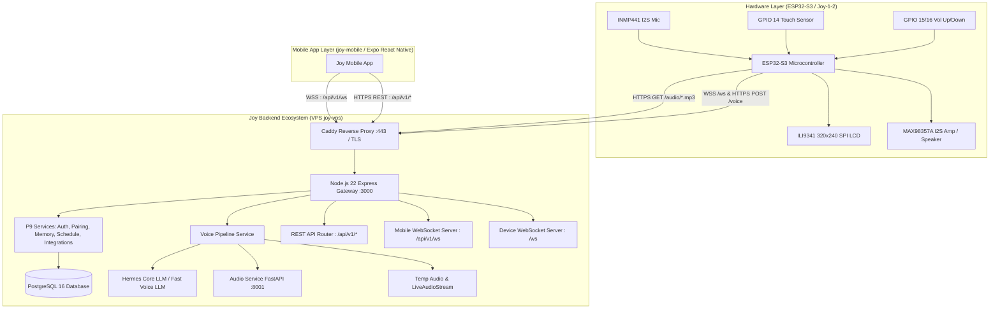
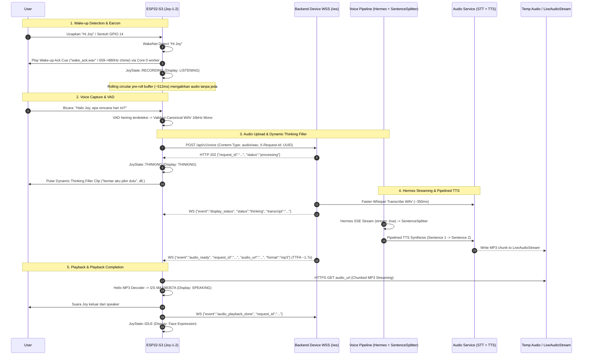
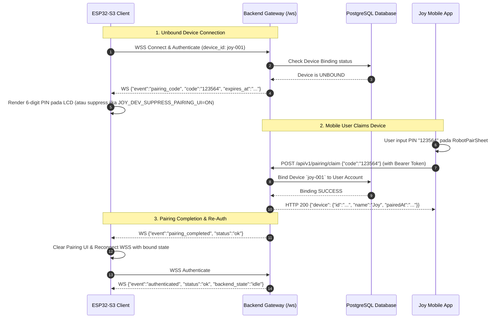

# Joy Ecosystem End-to-End Integration Guide
> **STATUS: CANONICAL / PRODUCTION-ALIGNED**
> Panduan integrasi komprehensif antara **ESP32-S3 Hardware Client (Joy-1-2)**, **Joy Mobile App (joy-mobile)**, dan **Joy Backend Ecosystem (P9 Platform + Streaming Voice Pipeline)**.

---

## 1. Arsitektur Komprehensif Ekosistem

Ekosistem Joy terdiri atas tiga pilar utama yang saling terintegrasi:



---

## 2. Matriks Boundary & Endpoint Ekosistem

| Komponen | Protokol | Endpoint / Port | Fungsi Utama | Kredensial & Autentikasi |
|---|---|---|---|---|
| **ESP32 Hardware WSS** | `wss://` | `wss://api.personalbmo.web.id/ws` | Event stream hardware, display status, audio ready, pairing code | `{"event":"authenticate", "device_id":"joy-001", "device_token":"..."}` |
| **ESP32 Audio Upload** | `https://` | `POST https://api.personalbmo.web.id/api/v1/voice` | Upload Canonical WAV (16kHz 16-bit Mono PCM) | Header: `X-Device-Id`, `X-Device-Token`, `X-Request-Id: UUIDv4` |
| **ESP32 Audio Download** | `https://` | `GET https://api.personalbmo.web.id/audio/:audioId.mp3` | MP3 Audio Stream (Chunked / Direct Transfer Encoding) | Tokenless public ephemeral URL ($\text{TTL} = 300\text{s}$) |
| **Joy Mobile WSS** | `wss://` | `wss://api.personalbmo.web.id/api/v1/ws` | Event stream mobile, chat thinking, notifications, integrations | `{"event":"authenticate", "accessToken":"<JWT>"}` |
| **Joy Mobile REST** | `https://` | `https://api.personalbmo.web.id/api/v1/*` | Auth, chat, robot pairing, memory, schedules, plugins, support | Header: `Authorization: Bearer <JWT>`, `X-Request-Id: UUIDv4` |
| **Mobile TTS Synthesize** | `https://` | `POST https://api.personalbmo.web.id/api/v1/tts/synthesize` | Sintesis audio ucapan instan untuk aplikasi mobile | Header: `Authorization: Bearer <JWT>`, Body: `{"text":"..."}` |

---

## 3. Alur Voice Interaction & Audio Pipeline



---

## 4. Alur Device Pairing 6-Digit (Mobile <-> ESP32 <-> Backend)



---

## 5. Fitur Integrasi Superpowers (Spotify, WhatsApp, Memory, Schedules)

### A. Spotify Integration
- **OAuth Connect**: `GET /api/v1/integrations/spotify/auth?returnTo=...` menghasilkan authorization URL Spotify.
- **Status Polling**: `GET /api/v1/integrations/spotify/status` mengembalikan status `CONNECTED`, `PENDING`, atau `DISCONNECTED`.
- **Playback & Controls**: `GET /api/v1/integrations/spotify/playback` dan `POST /api/v1/integrations/spotify/actions` (`PLAY`, `PAUSE`, `NEXT`, `PREVIOUS`, `SEEK`, `VOLUME`). Token dienkripsi dengan AES-GCM di backend.

### B. WhatsApp Hermes Integration
- **Pairing & QR**: `GET /api/v1/integrations/whatsapp/qr` mengembalikan QR string untuk di-scan via WhatsApp Linked Devices.
- **Konfirmasi**: `POST /api/v1/integrations/whatsapp/confirm` mengaktifkan status bridge WhatsApp.
- **Notification Rules**: `GET` / `PUT /api/v1/integrations/whatsapp/rules` mengatur forwarding pesan WhatsApp penting ke Joy.

### C. Long-Term Memory & Summaries
- **Memory Settings**: `GET` / `PATCH /api/v1/settings/memory` (mengatur preferensi penyimpanan memori).
- **Summary**: `GET /api/v1/memory/summary`, `POST /api/v1/memory/summary/regenerate`, `POST /api/v1/memory/summary/feedback`.

### D. Schedules & Proactive Reminders
- **Schedule Management**: `POST /api/v1/schedules` (membuat reminder harian), `POST /api/v1/schedules/:id/pause`, `POST /api/v1/schedules/:id/resume`, `DELETE /api/v1/schedules/:id`.
- **Proactive Delivery**: Backend mengirimkan proactive speech event ke physical ESP32 (`PlaybackJob` origin `PROACTIVE`) atau push notification ke mobile app.

---

## 6. Matrix Error Code & Handling

| Error Code | Asal | Deskripsi | Mitigasi & Tindakan Klien |
|---|---|---|---|
| `NO_SPEECH` | Backend STT | Tidak ada suara manusia yang terdeteksi dalam WAV | Mainkan tone feedback hening; kembali ke IDLE |
| `INVALID_AUDIO` | Backend STT | Format WAV bukan canonical 16kHz 16-bit Mono | Validasi lokal canonical WAV sebelum upload (`validate_canonical_wav()`) |
| `STT_FAILED` | Backend Audio | Transkripsi Faster-Whisper mengalami kegagalan | Mainkan error tone; izinkan user berbicara ulang |
| `HERMES_FAILED` | Backend LLM | Gagal memanggil endpoint Hermes LLM | Fallback otomatis ke Fast Voice LLM (Groq / OpenAI) di backend |
| `TTS_FAILED` | Backend Audio | Gagal sintesis suara Edge-TTS / Piper | Fallback otomatis ke Piper engine di backend |
| `AUDIO_EXPIRED` | Backend / HTTP 410 | File audio MP3 telah melewati TTL 300 detik | Terminal untuk request ID tersebut; jangan lakukan retry download |
| `WEBSOCKET_NOT_CONNECTED` | Backend HTTP 409 | Device belum terautentikasi di WebSocket | Reconnect WSS, lakukan auth, lalu retry upload |
| `DEVICE_BUSY` | Backend HTTP 409 | Request sebelumnya masih aktif diproses | Tunggu hingga transaksi aktif tuntas |
| `DOWNLOAD_FAILED` | ESP32 Playback | Gagal mengunduh stream MP3 dari `audio_url` | ESP mengirim WS `{"event":"audio_playback_failed", "reason":"DOWNLOAD_FAILED"}` |
| `DECODE_FAILED` | ESP32 Playback | Helix decoder corrupt / format audio tidak didukung | ESP mengirim WS `{"event":"audio_playback_failed", "reason":"DECODE_FAILED"}` |
| `PLAYBACK_FAILED` | ESP32 Playback | Gagal output data PCM ke I2S DAC MAX98357A | ESP mengirim WS `{"event":"audio_playback_failed", "reason":"PLAYBACK_FAILED"}` |

---

## 7. Panduan Verifikasi & Test Suite

### A. ESP32-S3 Firmware Contract Tests
Firmware dilengkapi dengan 93 contract test berbasis Python `unittest` di direktori `esp/tests/`:
```bash
cd esp
python3 -m unittest discover -s tests -v
```
Output:
```text
Ran 93 tests in 0.033s
OK (100% Passing)
```

### B. Mobile App Tests
Aplikasi Joy Mobile menggunakan Jest untuk unit testing hooks dan utilities:
```bash
cd /Users/ranggabiner/binerlabs/joy-mobile
npm test
```

### C. Backend Test Suite
Backend dilengkapi dengan unit & integration tests pada directory `backend/tests/`:
```bash
ssh joy-vps "sudo -iu bmo-admin bash -c 'cd /opt/bmo/app/backend && npm test'"
```
