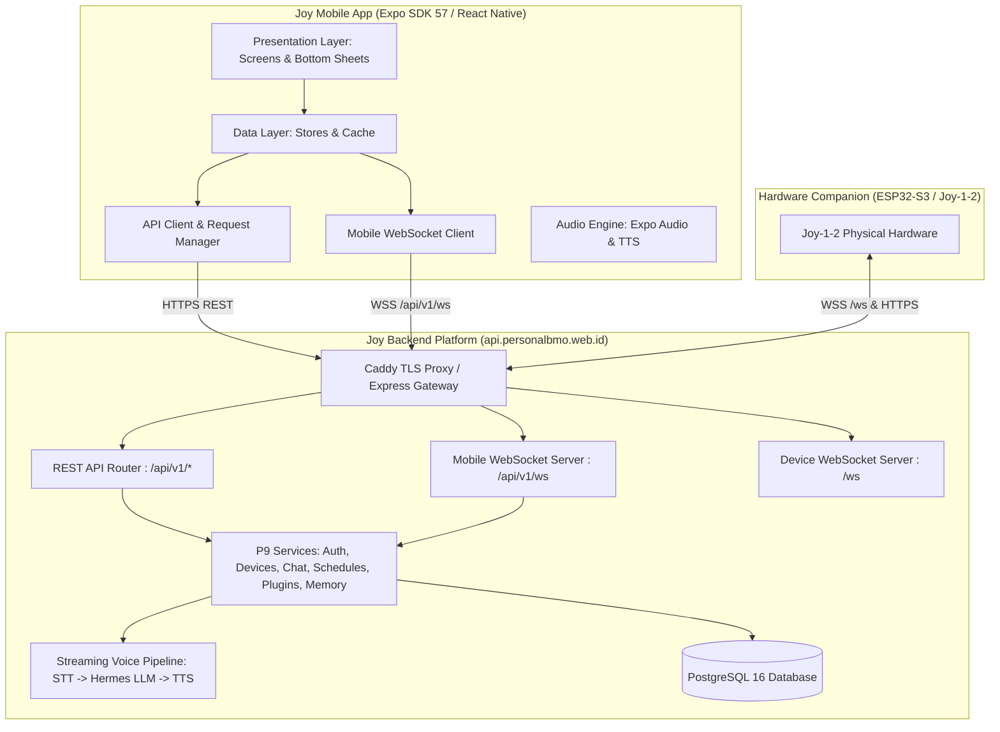

# Joy Mobile — AI Companion & Robot Controller App

> **Joy Mobile** is the official mobile companion app for the **Joy AI Ecosystem**, built with **React Native 0.86**, **React 19**, and **Expo SDK 57** (Expo Router v4). It enables seamless conversational AI chat, hardware companion pairing (ESP32-S3 Joy-1-2), proactive schedule management, WhatsApp & Spotify superpowers, and real-time bidirectional WebSocket synchronization.

---

## 1. System Overview & Ecosystem Architecture

Joy Mobile functions as the control center and primary mobile interface within the Joy ecosystem:



---

## 2. Core Features & Capabilities

### 💬 Conversational AI Chat
- **Realtime Streaming Chat**: WebSocket-powered message streaming with real-time thinking states (`chat_thinking`, `chat_message`).
- **Rich Message Presentation**: Markdown parsing, code blocks, quote handling, and prompt suggestions.
- **Message Action Bar**: Copy text, submit feedback (positive/negative with reasons), and speech playback.
- **Instant Speech Synthesis (TTS)**: Integration with Joy TTS API (`POST /api/v1/tts/synthesize`) with audio URL normalization, local caching, and fallback speech engines (`expo-audio` / `expo-speech`).
- **Temporary / Ephemeral Chats**: Support for non-persisted chat sessions for quick queries.
- **Pinned & Searchable Sessions**: Search and filter past chat conversations by keyword.

### 🤖 Robot Companion Management (ESP32-S3 Joy-1-2)
- **6-Digit PIN Device Claiming**: Interactive bottom sheet (`RobotPairSheet`) to claim physical Joy hardware using the 6-digit code shown on the robot LCD.
- **Real-Time Telemetry & Status**: Live monitoring of connection status (connected / disconnected), battery level, WiFi connection and RSSI signal strength via WebSocket `device_status`.
- **Voice Processing Mirroring**: Visual state updates reflecting robot processing (`voice_processing_status`: `thinking`, `audio_ready`, `completed`, `failed`).
- **Device Disconnection**: Secure unpairing and device releasing (`DELETE /devices/:deviceId`).

### 📅 Proactive Schedules & Reminders
- **Schedule Management**: Create, list, pause, resume, and cancel proactive schedules (`/schedules`).
- **Recurrence Support**: Flexible recurrence patterns (`ONCE`, `DAILY`, `WEEKLY` with specific days of the week).
- **Status Filtering**: Categorized views (`Active / Monitoring`, `Weekly`, `Paused`, `Completed`).
- **Real-Time Execution State**: WebSocket event `schedule_status` reflects schedule execution in real-time.

### ⚡ Superpower Plugins & Integrations
- **WhatsApp Hermes Integration**:
  - QR Code and 8-digit pairing code generation for WhatsApp Web/Multi-Device linkage.
  - Allowed contact management and notification mode settings.
  - Real-time WhatsApp notifications delivered to the mobile app via WebSocket `whatsapp_notification`.
- **Spotify Integration**:
  - Spotify OAuth authorization flow (`POST /plugins/spotify/auth-url`).
  - Playback control (Play, Pause, Next, Previous) and current track player display.
- **Plugin Catalog**: Dynamic catalog of available integrations with live connection statuses.

### 🔔 Push & In-App Notifications
- **Expo Push Notifications**: Token registration and lifecycle management (`/settings/push-tokens`).
- **Notification Channels**: Android notification channels configured for `joy-schedules` and `default`.
- **WebSocket Event Dispatching**: Immediate foreground banner notifications for system, schedule, and WhatsApp alerts.

### 👤 Account, Settings & Personalization
- **User Authentication**: Email & password login/registration, Google OAuth (`@react-native-google-signin/google-signin` / Expo AuthSession), secure JWT storage in `expo-secure-store`, auto token refresh (`/auth/refresh`), and recovery challenge password reset.
- **Profile Management**: Profile editing (`/account/profile`) and avatar image upload (`/account/avatar`).
- **Personalization Engine**: Customize Joy's nickname, user occupation, communication style & tone, and custom prompt instructions.
- **Long-Term Memory**: View and manage AI-extracted user memory summaries (`/account/memory`).
- **Bug & Issue Reporting**: In-app bug reporting with screenshot upload (`/support/issues`).
- **Theme & Appearance**: System / Light / Dark theme support with customizable accent colors using design tokens.

---

## 3. Tech Stack & Dependencies

| Category | Technology / Library | Version | Description |
|---|---|---|---|
| **Framework** | Expo SDK | `~57.0.15` | Universal React Native development platform |
| **Runtime** | React Native | `0.86.2` | Mobile framework running React 19.2.3 |
| **Routing** | Expo Router | `~57.0.15` | File-based routing with native stack & modals |
| **Animation** | React Native Reanimated | `4.5.1` | High-performance fluid 60fps animations |
| **Gestures** | React Native Gesture Handler | `~2.32.0` | Native touch & gesture handling |
| **Audio** | Expo Audio / Expo Speech | `~57.0.4` | Audio playback, TTS synthesis & recording |
| **Storage** | Expo SecureStore | `~57.0.1` | Encrypted keychain/keystore token storage |
| **Notifications** | Expo Notifications | `~57.0.15` | Local & remote push notifications |
| **UI & Icons** | Lucide React Native | `^1.29.0` | Feather/Lucide vector icon library |
| **Visual Effects** | Expo Blur / Glass Effect | `~57.0.2` | iOS/Android liquid glass & blur overlays |
| **SVG & QR** | react-native-svg / qrcode-svg | `^15.15.4` | Vector graphics & QR code rendering |
| **Design Connect**| @figma/code-connect | `^1.5.1` | Figma design system component synchronization |
| **Language** | TypeScript | `~6.0.3` | Strict static typing |

---

## 4. Architecture & Engineering Principles

The Joy Mobile codebase strictly follows **Clean Architecture** and **Atomic Design**:

```text
src/
├── app/                               # Expo Router file-based routes (_layout.tsx, index.tsx, etc.)
├── components/
│   └── ui/                            # Atomic UI components (Buttons, Inputs, Modals, Overlays)
├── constants/
│   └── theme.ts                       # Centralized Design Tokens (Colors, Spacing, Typography, Layering)
├── features/                          # Feature-sliced modules (Clean Architecture)
│   ├── auth/                          # Authentication (data, domain, presentation)
│   ├── chat/                          # Conversational AI chat & TTS speech
│   ├── robot/                         # Robot companion pairing & telemetry
│   ├── schedules/                     # Schedules & proactive reminders
│   ├── plugins/                       # WhatsApp & Spotify superpowers
│   ├── notifications/                 # Push token & notification management
│   ├── settings/                      # Profile, personalization, memory, bug reports
│   └── splash/                        # Animated splash & greeting
├── hooks/                             # Shared React hooks (transitions, speech, gestures)
└── lib/
    └── api/                           # Core REST client, Mobile WebSocket client, UUIDs
```

### Layer Responsibilities
- **Domain Layer (`domain/`)**: Pure TypeScript models, types, business rules, and error mappers. Independent of UI and external libraries.
- **Data Layer (`data/`)**: API clients, stores, local storage persistence, and WebSocket subscribers.
- **Presentation Layer (`presentation/` & `components/`)**: React Native UI components, screens, bottom sheets, hooks, and animations.
- **Design Tokens (`src/constants/theme.ts`)**: Single source of truth for colors, typography, spacing, border radii, shadows, and sheet layering. No magic numbers or hardcoded hex colors.

---

## 5. Environment Configuration

Create a `.env` file in the root directory (based on `.env.example`):

```ini
# Backend API Base URL (Production or local dev gateway)
EXPO_PUBLIC_API_BASE_URL=https://api.personalbmo.web.id

# Google OAuth Web Client ID (from Google Cloud Console)
EXPO_PUBLIC_GOOGLE_CLIENT_ID=your_google_web_client_id_here
```

---

## 6. Installation & Development

### Prerequisites
- **Node.js**: v20.x or v22.x LTS
- **Package Manager**: `pnpm` (recommended) or `npm`
- **Expo Go App**: Installed on physical Android / iOS device, or an active Android Emulator / iOS Simulator.

### Getting Started
```bash
# 1. Clone repository & navigate to directory
cd /Users/ranggabiner/binerlabs/joy-mobile

# 2. Install dependencies
pnpm install

# 3. Start Expo development server
pnpm dev
```

### Running on Targets
```bash
# Run on Android Emulator
pnpm android

# Run on iOS Simulator
pnpm ios

# Run in Web Browser
pnpm web

# Run Linter
pnpm lint
```

---

## 7. Testing & Quality Assurance

Joy Mobile includes unit tests and automated Maestro end-to-end visual tests:

```bash
# Run visual & syntax tests for splash screen
pnpm test:splash:syntax
pnpm test:splash:geometry
pnpm test:splash:visual

# Run visual & syntax tests for authentication
pnpm test:auth:syntax
pnpm test:auth:visual
```

---

## 8. Documentation Index

For in-depth technical specifications, please consult the dedicated documentation files:

- 🏛️ [**Architecture & Design System Guide**](./docs/ARCHITECTURE.md) — Deep dive into Clean Architecture, Atomic Design, state management, and tokens.
- 🔌 [**API & WebSocket Protocol Specification**](./docs/API_AND_WEBSOCKET_SPEC.md) — Complete specification of all REST endpoints, WebSocket events, payload schemas, and error codes.
- 🤖 [**Robot Pairing & Ecosystem Integration**](./docs/ROBOT_PAIRING_AND_ECOSYSTEM.md) — How Joy Mobile interacts with the ESP32-S3 hardware companion and backend pipeline.
