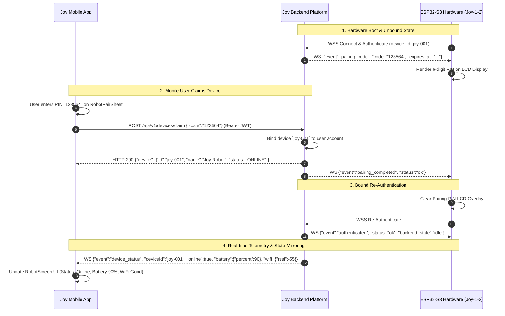
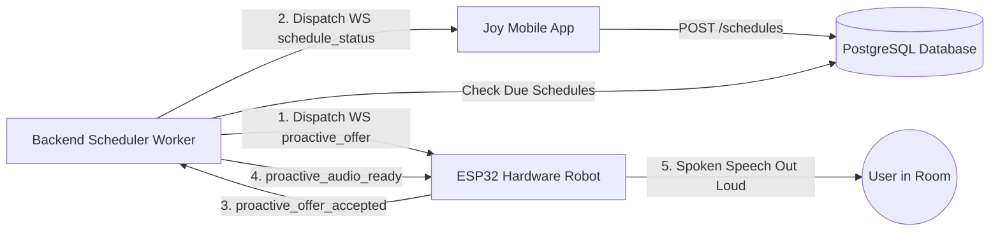

# Joy Mobile — Robot Pairing & Ecosystem Integration Guide

> **Scope**: Integration between **Joy Mobile App (Expo / React Native)**, **Joy-1-2 ESP32-S3 Hardware Client**, and **Joy Backend Platform**.  
> **Status**: Production Canonical  

---

## 1. The Joy Ecosystem Companion Paradigm

Joy is designed as a unified AI presence that spans both physical hardware (the Joy-1-2 desktop robot) and mobile devices (Joy Mobile App). Rather than operating as isolated silos, the mobile app and robot hardware share:
1. **A Single Unified User Identity**: Chat conversations, memory, preferences, and schedules created on mobile are immediately available to the desktop robot.
2. **Real-time State Mirroring**: When the physical robot is listening, thinking, or speaking, the mobile app reflects its status live via WebSocket.
3. **Proactive Delivery Synchronization**: Reminders and alerts scheduled via mobile are spoken out loud by the physical robot in the user's home or office.



---

## 2. 6-Digit PIN Pairing Protocol Deep-Dive

### A. Hardware Side (ESP32-S3)
1. Upon connecting to `wss://api.personalbmo.web.id/ws`, an unclaimed device receives the `pairing_code` event:
   ```json
   {
     "event": "pairing_code",
     "code": "123564",
     "expires_at": "2026-08-27T12:05:00Z"
   }
   ```
2. The firmware renders the 6-digit code in high-contrast glyphs across the ILI9341 LCD face. (During development, rendering can be suppressed with `-D JOY_DEV_SUPPRESS_PAIRING_UI=ON`).
3. The PIN expires after 5 minutes, after which the backend issues a new code.

### B. Mobile Side (`RobotPairSheet`)
1. User opens the **Robot** tab on Joy Mobile and taps **"Pair Joy Robot"**.
2. The `RobotPairSheet` bottom sheet opens, presenting a 6-cell auto-advancing PIN input.
3. As soon as the 6th digit is entered, the app invokes `claimWithCode(code)`:
   ```typescript
   // src/features/robot/data/use-robot-connection.ts
   await apiRequest('/devices/claim', {
     method: 'POST',
     body: { code: '123564' },
   });
   ```
4. On `HTTP 200 OK`, the sheet executes a smooth slide transition to `ConnectedSuccessHero` and subscribes to the device's WebSocket telemetry channel.

---

## 3. Real-Time Telemetry & Status Mirroring

Once paired, the backend pushes live hardware telemetry to the mobile app via WebSocket:

### A. Device Online & Battery Telemetry (`device_status`)
```json
{
  "event": "device_status",
  "deviceId": "joy-001",
  "online": true,
  "lastSeenAt": "2026-08-27T12:00:00Z",
  "wifi": {
    "connected": true,
    "rssi": -58
  },
  "battery": {
    "supported": true,
    "percent": 88
  }
}
```
- **Mobile UI Response**: The `ConnectedRobotHeroCard` displays a live green "Online" badge, accurate battery icon/percentage, and WiFi signal bars.

### B. Voice Pipeline Mirroring (`voice_processing_status`)
When a user speaks to the physical robot ("Hi Joy..."), the backend broadcasts pipeline status to mobile:
```json
{
  "event": "voice_processing_status",
  "deviceId": "joy-001",
  "requestId": "727675d7-46d2-424d-ab6f-5c3898f04c96",
  "status": "thinking",
  "errorCode": null
}
```
- **Statuses**:
  - `thinking`: Robot is transcribing audio and generating LLM response.
  - `audio_ready`: Response audio stream is ready.
  - `completed`: Playback finished successfully.
  - `failed`: Pipeline encountered an error.

---

## 4. Proactive Schedules & Spoken Delivery

Schedules created within the Joy Mobile app are executed by the backend and delivered dynamically:



1. **User Creates Schedule**: User sets a daily reminder: *"Ingatkan aku minum vitamin dan air putih jam 8 pagi"*.
2. **Trigger Execution**: At 08:00 AM, the scheduler synthesizes speech and sends a `proactive_offer` to the hardware client.
3. **Hardware Arbitration**: If the hardware is currently idle, it accepts the offer (`proactive_offer_accepted`), downloads the MP3 stream, and speaks the reminder aloud through its MAX98357A speaker.
4. **Mobile Notification**: Simultaneously, the mobile app receives a push notification and a `schedule_status` WebSocket event marking the run as completed.

---

## 5. Superpower Plugins: WhatsApp Hermes & Spotify

### WhatsApp Integration
1. Mobile initiates pairing via `POST /plugins/whatsapp/start`, displaying a QR code.
2. User links WhatsApp via Linked Devices.
3. When urgent messages arrive from allowed contacts, the backend alerts the mobile app (`whatsapp_notification`) and can speak an acoustic notification on the physical robot.

### Spotify Playback
1. User connects Spotify via mobile OAuth (`POST /plugins/spotify/auth-url`).
2. User can ask Joy either via mobile chat or robot voice command (*"Joy, putar lagu jazz santai di Spotify"*).
3. Backend issues playback commands directly to the user's Spotify Connect devices.
